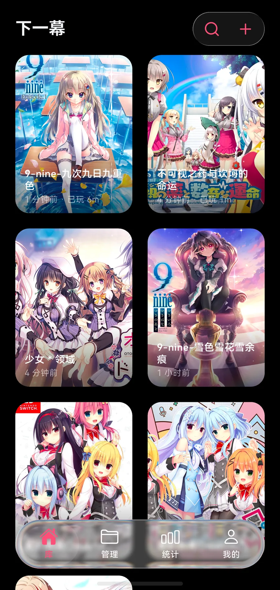
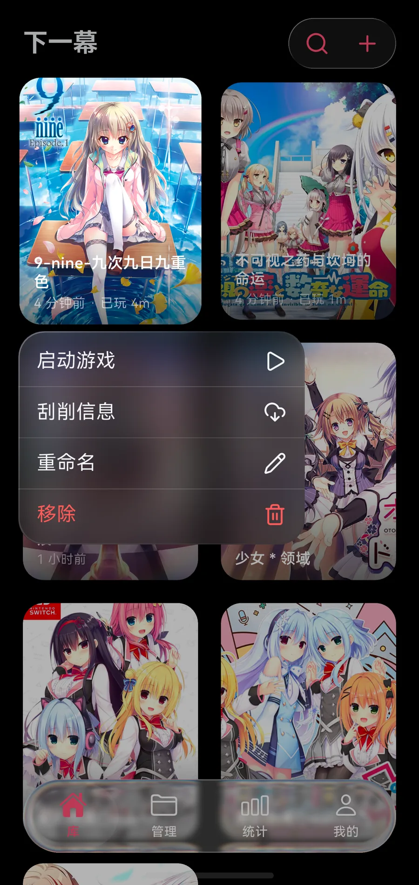
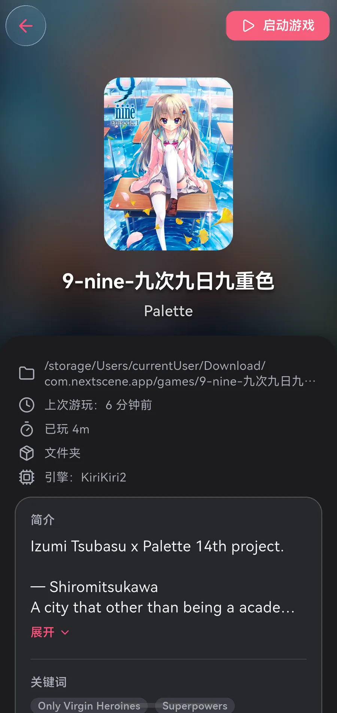
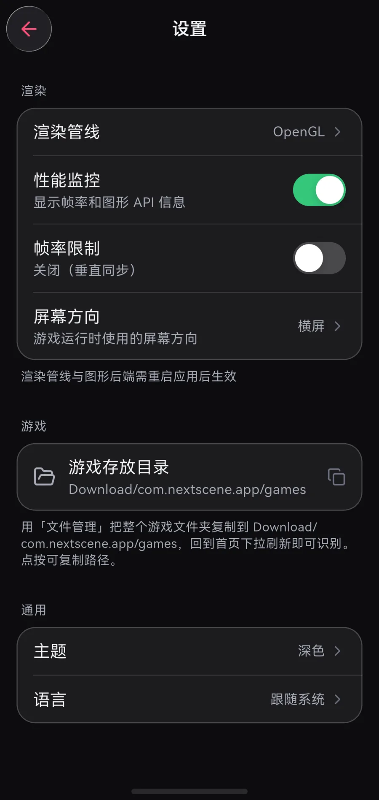
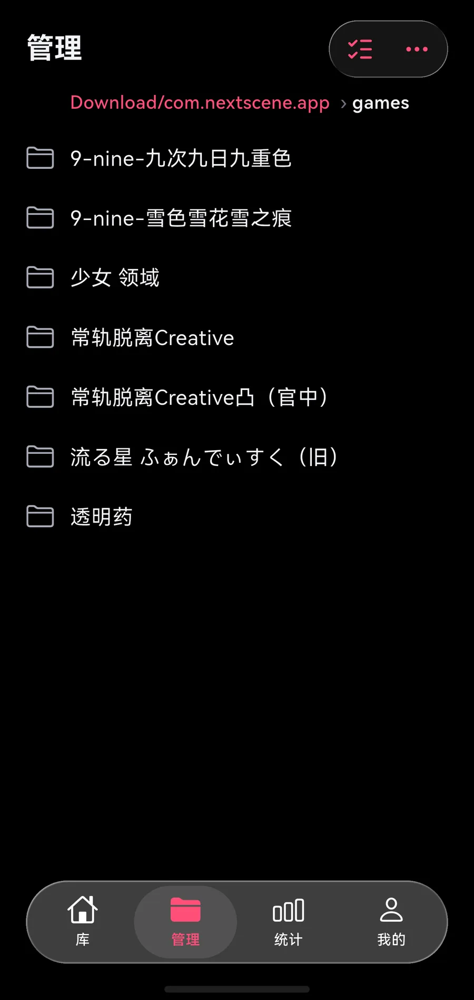
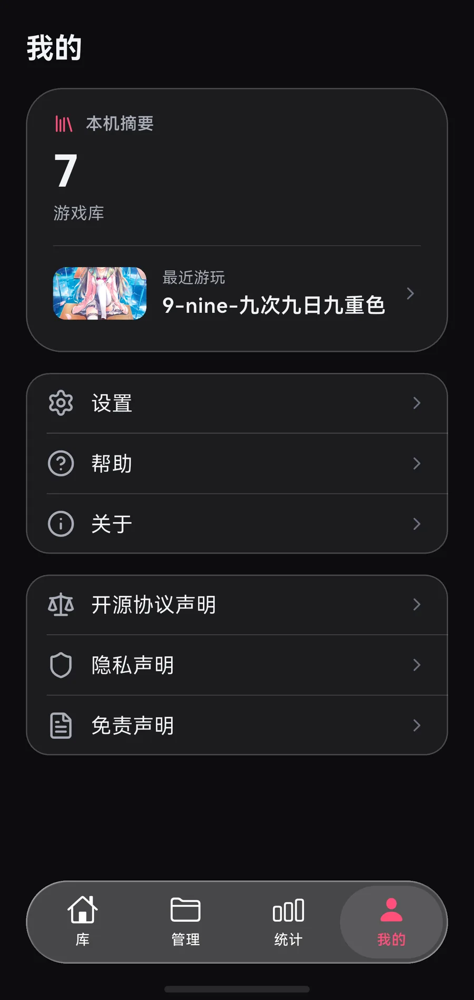
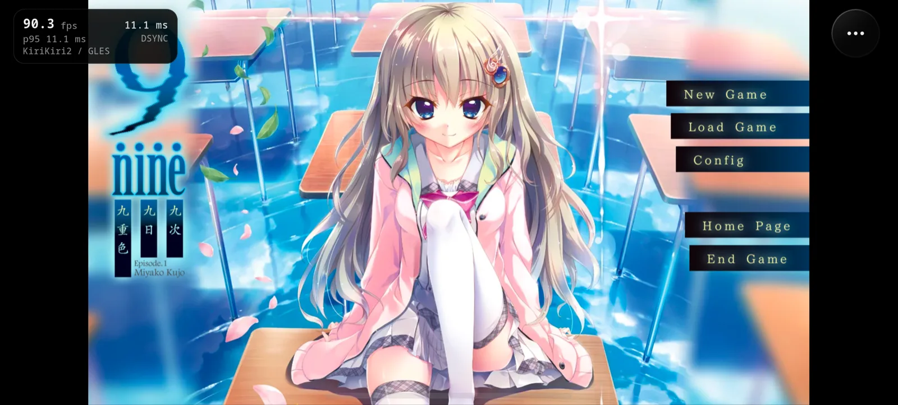
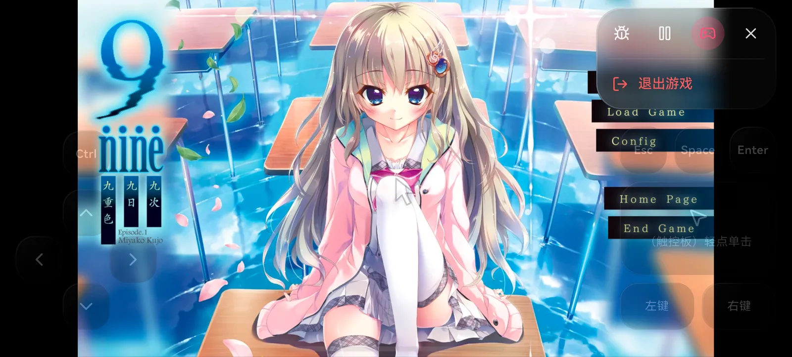

<p align="center">
  <h1 align="center">NextScene</h1>
  <p align="center">A next-generation cross-platform visual novel emulator, rebuilt with Flutter</p>
</p>

<p align="center">
  
  
  
  
  
</p>

---

**语言 / Language**: [中文](README.md) | English

> 🙏 This repository (the HarmonyOS adaptation) is derived from [reAAAq/KrKr2-Next](https://github.com/reAAAq/KrKr2-Next), adding HarmonyOS/OpenHarmony (native OHOS) support on top of it. Many thanks to the original author. The upstream project itself is a refactor based on [krkr2](https://github.com/2468785842/krkr2) — credits to them as well.

## Overview

**NextScene** is a modern, cross-platform runtime for the [KiriKiri2](https://en.wikipedia.org/wiki/KiriKiri) visual novel engine. It runs original game scripts, uses modern graphics APIs for hardware-accelerated rendering, and includes a number of rendering and script-execution optimizations. The UI is Flutter; target platforms are macOS · iOS · Windows · Linux · Android · HarmonyOS/OpenHarmony. On HarmonyOS the same HAP also runs Artemis games (`.pfs`).

## Interface Preview

The screenshots below were captured on a physical HarmonyOS SDK 20 device. Portrait shots have the system status bar cropped out. The app shell is four tabs: Library / Manage / Stats / Me. The in-game shots are the title screen of *9-nine- Episode 1: Miyako Kujo* (*九次九日九重色*), with the performance overlay turned on.

<table>
  <tr>
    <td align="center" width="50%">
      <br>
      <sub>Library</sub>
    </td>
    <td align="center" width="50%">
      <br>
      <sub>Long-press quick actions</sub>
    </td>
  </tr>
  <tr>
    <td align="center" width="50%">
      <br>
      <sub>Game details</sub>
    </td>
    <td align="center" width="50%">
      <br>
      <sub>Settings</sub>
    </td>
  </tr>
  <tr>
    <td align="center" width="50%">
      <br>
      <sub>Manage</sub>
    </td>
    <td align="center" width="50%">
      <br>
      <sub>Me</sub>
    </td>
  </tr>
</table>

### Game Running in Landscape

<p align="center">
  <br>
  <sub>*9-nine- Episode 1: Miyako Kujo* title screen · KiriKiri2 / GLES · ~90 fps</sub>
</p>

<p align="center">
  <br>
  <sub>In-game quick controls (pause / virtual pad / exit)</sub>
</p>

## Architecture

<p align="center">
  
</p>

**Rendering Pipeline**: On desktop and most mobile targets the engine renders offscreen through ANGLE's EGL Pbuffer (OpenGL ES 2.0), then hands the frame to Flutter via platform texture sharing (macOS → IOSurface, Windows → D3D11 Texture, Linux → DMA-BUF). HarmonyOS skips ANGLE and uses system EGL (GLES) into a pbuffer, presented through OHNativeWindow / RawImage readback.


## Development Progress

> ⚠️ This project is under active development. No stable release is available yet. This fork is currently focused on HarmonyOS hardware; upstream macOS remains the most complete desktop build.

| Module | Status | Notes |
|--------|--------|-------|
| C++ Engine Core Build | ✅ Done | KiriKiri2 core engine compiles on all platforms |
| ANGLE Rendering Migration | ✅ Mostly Done | Replaced legacy Cocos2d-x + GLFW pipeline with EGL/GLES offscreen rendering |
| engine_api Bridge Layer | ✅ Done | Exports `engine_create` / `engine_tick` / `engine_destroy` C APIs |
| Flutter Plugin | ✅ Mostly Done | Platform Channel communication, Texture bridge |
| Zero-Copy Texture Rendering | ✅ Mostly Done | Zero-copy engine render frame sharing to Flutter via platform-native texture mechanisms |
| Flutter App Shell | ✅ Mostly Done | Library / Manage / Stats / Me, plus Settings, Help, About, and the performance overlay |
| Input Event Forwarding | ✅ Mostly Done | Mouse / touch event coordinate mapping and forwarding to the engine |
| Engine Performance Optimization | 🔨 In Progress | SIMD pixel blending, GPU compositing pipeline, VM interpreter optimization, etc. |
| Game Compatibility | 🔨 In Progress | Completing the script parser, adding plugins. Current goal: match compatibility with Z's closed-source build |
| Original krkr2 Emulator Feature Porting | 📋 Planned | Gradually port original krkr2 emulator features to the new architecture |

## Platform Support

| Platform | Status | Graphics Backend | Texture Sharing |
|----------|--------|-----------------|----------------|
| macOS | ✅ Mostly Done | Metal | IOSurface |
| iOS | 🔨 Pipeline Working, Optimizing OpenGL Rendering | Metal | IOSurface |
| Windows | 📋 Planned | Direct3D 11 | D3D11 Texture |
| Linux | 📋 Planned | Vulkan / Desktop GL | DMA-BUF |
| Android | 🔨 Pipeline Working, Optimizing | OpenGL ES / Vulkan | HardwareBuffer |
| HarmonyOS / OpenHarmony | 🔨 Playable on device (SDK 20), still optimizing; also runs Artemis (.pfs) | System EGL (GLES) / software compositing | OHNativeWindow / RawImage readback |

## HarmonyOS / OpenHarmony Support

This repository adds native HarmonyOS/OpenHarmony (API 20 / SDK 5.x) support on top of upstream: the C++ engine core is cross-compiled with the OHOS NDK (llvm + musl) into `libengine_api.so`, packaged into the HAP and loaded by the Flutter OHOS host. Audio goes through the system OHAudio API; fonts are registered directly from `/system/fonts` (NotoSansCJK etc.).

### Prerequisites

1. [DevEco Studio](https://developer.huawei.com/consumer/cn/deveco-studio/) with the OpenHarmony SDK (tested with API 20)
2. The Flutter OHOS fork: [flutter_flutter_ohos](https://gitcode.com/openharmony-sig/flutter_flutter) (tested on branch `oh-3.41.9-release`); add its `bin` to PATH
3. Check out [ohos_flutter_packages](https://gitcode.com/openharmony-sig/flutter_packages) as a **sibling** directory named `ohos_flutter_packages/` (the OHOS-only `dependency_overrides` live in `apps/flutter_app/pubspec_overrides.ohos.yaml`; the build script copies them to `pubspec_overrides.yaml` automatically. Other platforms are unaffected and do not need this checkout)
4. vcpkg dependencies per the root `vcpkg.json`, using the `vcpkg/triplets/arm64-ohos.cmake` triplet

### Build & Install

```bash
./build/build_ohos.sh release     # cross-compile the engine + flutter build hap
hdc install -r apps/flutter_app/build/ohos/hap/entry-default-signed.hap
# if local signing is not configured, use the unsigned HAP instead:
# hdc install -r apps/flutter_app/ohos/entry/build/default/outputs/default/entry-default-unsigned.hap
```

> ⚠️ Performance note: never benchmark the `debug` build — CMake Debug is `-O0`, which
> degrades the Highway SIMD blend kernels into out-of-line calls per 16-pixel chunk
> (roughly two orders of magnitude slower full-frame compositing). Release is
> `-O2 -DNDEBUG` plus Flutter AOT.

### Notes & Known Limitations

- On the emulator, switch to **renderer=software** in Settings (software rendering + the RawImage path); the emulator GPU is unstable under frequent texture uploads. Real devices should use the default OpenGL path
- Game import: on Library, tap Add Game and pick a full game folder, or an XP3 / PFS archive. On HarmonyOS you can also copy the folder into `Download/com.nextscene.app/games` with the system Files app and pull-to-refresh on Library; the Manage tab browses that directory. `hdc file send` into the same place works too
- The Cubism Live2D plugin is not built on OHOS yet (no prebuilt Core); layerex_draw (libgdiplus) likewise
- Engine logs go to both hilog (tag `krkr2`) and `files/flutter/krkr2-engine.log` inside the app sandbox
- The game page supports landscape/portrait switching: pick the default in Settings → "Screen Orientation" (landscape / portrait / follow system) and flip it at any time from the in-game overlay menu ("Rotate Screen")

### Artemis Engine games (.pfs)

The OHOS build additionally bundles [artemis-compat](https://github.com/Weiss-UltimateSavior/artemis-compat) (a clean-room Artemis Engine compatible runtime, GPL-3.0, vendored under `cpp/artemis/`; pinned commit in `cpp/artemis/upstream/UPSTREAM.md`). The single `libengine_api.so` dispatches on the game path: a `.pfs` pack or a directory holding one goes to the Artemis backend, everything else to KiriKiri2.

- Rendering: the GLES2 layer compositor draws into the same EGL pbuffer krkr2 uses and frames are presented through the RawImage readback (static frames skip the readback based on the layer revision counter); audio goes through OHAudio (one renderer per voice)
- Import: the game directory must contain the base pack `root.pfs` plus its patch volumes `root.pfs.000/.001…`; saves (`*.dat`) are written next to it. Drop the folder into `Download/com.nextscene.app/games` and pull-to-refresh on Library, or use Add Game to pick the folder / PFS. `hdc file send` followed by the same refresh or Add Game path also works (the ArkTS layer copies the pack chain and saves into the cache, then the app moves them into `files`)
- Compatibility follows upstream plus a set of engine fixes/additions made here (`e:random` integer semantics, `e:loadPngComments` face-part anchors, composed layer transforms, `[stop]`/`[return]` call-stack semantics, cross-file `[return]`, event-owner click dispatch, real `lytween` tweens and `trans` crossfades, `wait se=` / `setonsoundfinish` — full list in `cpp/artemis/upstream/UPSTREAM.md`): verified on the emulator with *Hamidashi Creative Totsu* through title (with intro animation) → STORY SELECT → prologue choice → story text / sprites / name plates, with no Lua errors in the engine log
- Still missing: video playback (the `video` tag is skipped and the story resumes), E-mote puppets (closed M2 middleware, not feasible), `anime` frame animations and `rotate` tweens
- Logs: hilog tag `Artemis` (domain `0x0207`), mirrored into `krkr2-engine.log` with an `[artemis]` prefix

## Building from Source on macOS

```bash
./build/build_macos.sh debug      # engine + Flutter app (Xcode required)
```

The Live2D Cubism SDK **cannot be redistributed** and is therefore not part of the repo (`Core/lib/` and `Framework/` under `cpp/plugins/cubism/` are gitignored). Place them manually before the first build:

- `Core/`: the `Core` directory from the official [CubismSdkForNative](https://cubism.live2d.com/sdk-native/en/) archive (tested with 5-r.5) — prebuilt `libLive2DCubismCore.a` per platform plus headers;
- `Framework/`: the patched Framework from [KiriKiri-LauncherC](https://github.com/xiaocongyu66/KiriKiri-LauncherC) (keeps the `SetDrawableForceHidden` extension APIs krkrlive2d.cpp relies on).

UI-less engine smoke tests do not require Xcode/Flutter: link `out/macos/debug/bridge/engine_api/libengine_api.dylib` directly and drive the engine_api C ABI (`engine_open_game_async` accepts `.xp3` archives or extracted directories). Set `KRKR_HEADLESS=1` to have the engine log system dialogs to stderr instead of showing them.

## Engine Performance Optimization

| Priority | Task | Status |
|----------|------|--------|
| P0 | Pixel Blend SIMD ([Highway](https://github.com/google/highway)) | ✅ Done |
| P0 | Full GPU Compositing Pipeline | 🔨 In Progress |
| P0 | TJS2 VM Interpreter (computed goto) | 📋 Planned |

## License

This project is licensed under the GNU General Public License v3.0 (GPL-3.0). See [LICENSE](./LICENSE) for details.
